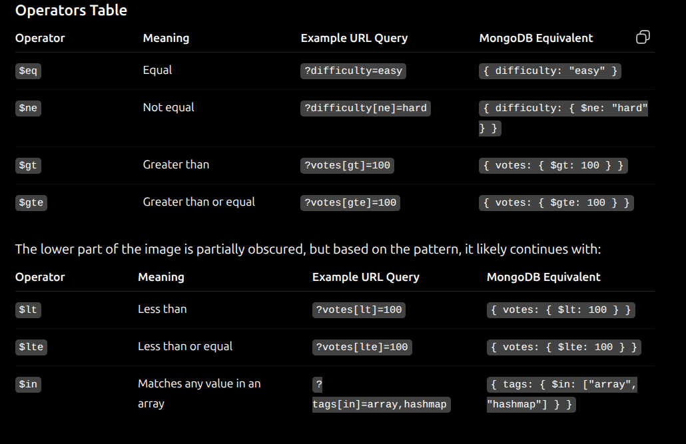

==================day 06===================
Pagination:--> is a technique used to fetch a limited number of documents at a time instead of retrieving the entire collection. It improves performance and reduces database load.

app.get("/users", async (req, res) => {
    const page = Number(req.query.page) || 1;
    const limit = Number(req.query.limit) || 10;
    const Skip=(page-1)*limit

    const users = await User.find()
        .skip(Skip)
        .limit(limit);

    res.json(users);
});

//......................................
Problem.find({
    votes: { $gte: 100 },
    tags: { $in: ["array", "hashmap"] }
})
Field
difficulty:

Operators Table

Operator	        Meaning	                Example URL Query	            MongoDB Equivalent
$eq	                Equal	                ?difficulty=easy	             { difficulty: "easy" }
$ne	                Not equal	            ?difficulty[ne]=hard	         { difficulty: { $ne: "hard" } }
$gt	                Greater than	        ?votes[gt]=100	                  { votes: { $gt: 100 } }
$gte	        Greater than or equal	    ?votes[gte]=100	                  { votes: { $gte: 100 } }
This is a common reference table used to convert Express URL query parameters into MongoDB query operators.